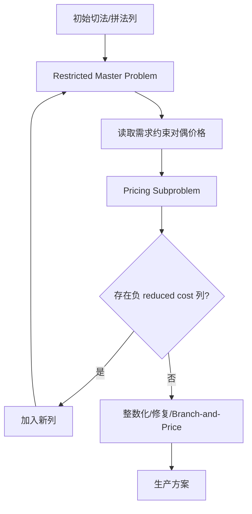
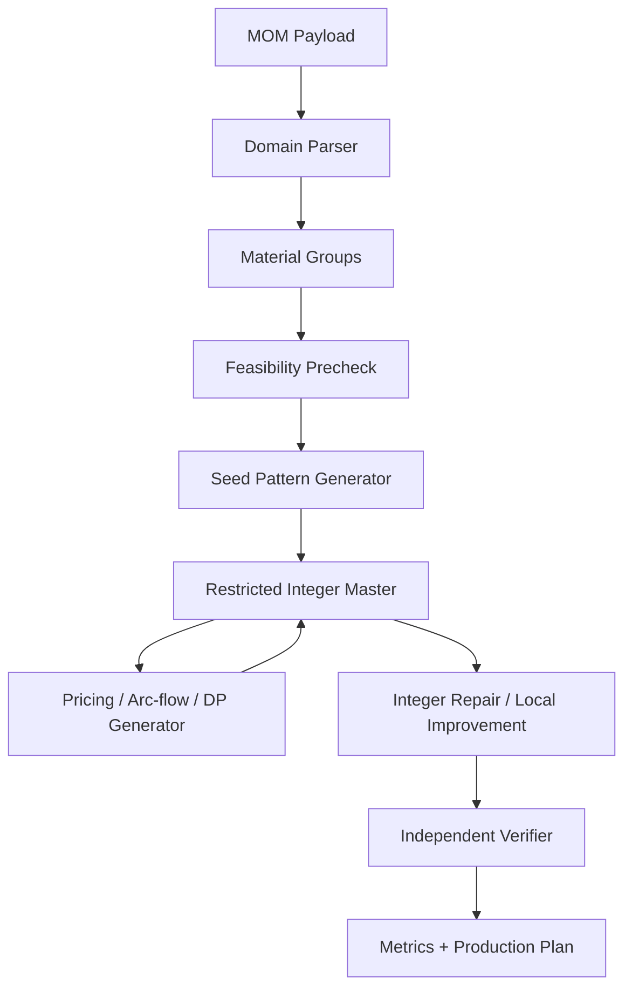

# 蛇形管切割 + 焊接排料最佳实践调研报告

## 1. 结论摘要

当前项目不应继续沿着“遇到一个样本、补一个规则”的方式演进。蛇形管排料的本质不是普通一维下料，也不是单纯靠 GA、SA、贪心或逐管 DP 就能稳定解决的问题；它是一个带焊接、库存、多目标、花样最少化和工艺约束的工业级组合优化问题。

更准确的问题归类是：

- **1D Cutting Stock Problem**：一维下料基础问题。
- **Variable-sized Cutting Stock Problem**：多种母料定尺和有限库存。
- **Cutting Stock Problem with Welding**：成品管可以由多个段焊接拼成。
- **Cutting Stock Problem with Setup Cost / Pattern Minimization Problem**：切法、拼法、段长花样越多，生产换型成本越高。
- **Industrial matheuristic / column generation problem**：实际规模大、约束多，通常需要数学规划与启发式结合。

调研后的推荐方向是：

> 以 **集合覆盖 / 列生成 / 弧流** 作为主建模框架，以 **受限模式池 + 多阶段整数优化 + 启发式修复/改良** 作为工业落地方式。局部贪心、逐管 DP、GA、SA、LNS 可以作为候选生成、暖启动、修复或改良工具，但不应再作为主模型。

这意味着后续应重写核心求解器，而不是继续修补 `baseline`、`route3` 或某个 POC。现有代码中值得复用的是输入契约、整数毫米归一化、独立校验器、样本回归体系、API 外壳和部分候选生成经验。

## 2. 本业务问题的正确归类

### 2.1 基础层：一维下料问题

传统一维下料问题的目标是从母料中切出若干需求段，使母料使用量或废料最少。经典建模方式是 Gilmore-Gomory 模型：每一种切法是一个列，主问题选择每个切法使用多少次。

对应到本项目：

| 标准 CSP 概念 | 本项目概念 |
| --- | --- |
| stock / roll / bar | 母料、定尺原管 |
| item / order width | 段长需求 |
| cutting pattern | 一根母料的切法 |
| pattern frequency | 某切法使用的母料根数 |
| trim loss | 切割余料 / 废料 |

但蛇形管不是直接需求某些段长，而是需求“成品管”。成品管又可以由多个段焊接而成，所以问题比普通 CSP 多了一层拼接决策。

### 2.2 焊接层：Cutting Stock Problem with Welding

带焊接的一维下料问题中，一根成品管可以由多根母料上的段拼成。文献中这类问题通常仍然可以用列生成处理：

- 主问题选择切割/焊接模式。
- 子问题生成能够改善目标的模式。
- 如果列生成得到分数解，需要额外整数规划、branch-and-price 或启发式整数修复。

对应到本项目：

| 焊接 CSP 概念 | 本项目概念 |
| --- | --- |
| produced pipe | 成品蛇形管 |
| splice / weld | 焊口 |
| welding pattern | 某管型的段序列，例如 `(6500, 6200, 5800)` |
| welding feasibility | 最大焊口、禁焊区、最小焊距、最小段长 |
| segment balance | 切割侧产出的段长必须覆盖拼接侧消耗的段长 |

关键结论：**拼法必须进入模型，而不能只作为后处理。** 如果先局部切料再试图拼管，容易出现“料总长够，但都被切成小碎片，焊口数超限”的失败，这是全局资源分配问题。

### 2.3 花样层：Pattern Minimization / Setup Cost

生产现场真正痛苦的不是只多用一两根母料，而是切法、拼法、段长种类太多导致换刀、换工装、排产复杂。文献中这被称为：

- Pattern Minimization Problem (PMP)
- Cutting Stock Problem with Setup Cost (CSP-S)

经典结论是：PMP 比普通 CSP 更难，不能简单地在大 MILP 中加一堆 `y_p` binary 变量然后指望通吃全规模。成熟实践通常是：

- 先控制用料或利用率；
- 再在受限候选池里压缩切法数量；
- 或把 pattern frequency、setup cost 单独建模；
- 必要时使用 branch-and-price-and-cut、arc-flow、local branching、relax-and-fix 等方法。

对应到本项目：

| Setup / Pattern 概念 | 本项目指标 |
| --- | --- |
| cutting pattern setup | 切法种类数 `cut_types` |
| welding pattern setup | 拼法种类数 `weld_types` |
| item alphabet complexity | 段长种类数 `seg_types` |
| setup frequency | 每种切法/拼法复用次数 |
| production simplicity | 车间组织生产难度 |

## 3. 外部成熟实践综述

### 3.1 Column Generation 是 CSP 的经典主线

当切法数量指数爆炸时，不应一次性枚举所有列。列生成的基本结构是：

普通一维下料的 pricing 子问题通常是 knapsack。带焊接、禁焊区、焊口限制后，pricing 子问题会更像资源约束最短路、动态规划或弧流图上的路径生成。

适用判断：

- 列空间巨大；
- 初始列池很难覆盖所有高质量方案；
- 需要根据当前主问题对偶价格动态生成真正有价值的模式。

### 3.2 Arc-flow / Reflect Arc-flow 是压缩模式空间的重要路线

弧流模型把所有可行切法表示成有向无环图中的路径，避免显式列枚举。图压缩后，求解器可以在更紧凑的网络结构上处理大量模式。

适用判断：

- 段长字母表较大，但存在大量可共享状态；
- 需要表达多种 stock size；
- pricing 或模式枚举需要稳定且可控的状态空间。

风险：

- 带焊接禁区、管型特异约束后，直接建完整 arc-flow 可能复杂；
- 更适合作为切割侧或 pricing 子问题的实现方式，而不一定一开始就作为全系统主模型。

### 3.3 Matheuristic 是工业落地常态

真实工业 CSP 很少依赖单一纯精确模型，因为：

- setup cost 会显著增加 binary 变量；
- 多 stock size、库存、余料、焊接规则会导致模型迅速变大；
- 列生成 LP 解经常是分数解；
- 生产需要的是稳定高质量方案，不一定每次证明全局最优。

成熟实践通常组合使用：

- column generation 产生强模式池和好下界；
- restricted integer master 求整数方案；
- round-up / diving / relax-and-fix 做整数修复；
- local branching 或 LNS 在 incumbent 附近改良；
- 多阶段目标函数避免一次性 Big-M 模型爆炸。

对应本项目，这说明：

> 我们要追求的是“统一数学模型 + 工业级求解流程”，而不是“一个万能 MILP 一把梭”。

## 4. 本项目现状与外部实践的差距

### 4.1 现有路线的问题

根据现有 SPEC 和技术路线记录，项目已经经历过多条路线：

- GPU 加速候选生成；
- 等价母材归约；
- route3 顺序 DP；
- route3 + LNS；
- GA 外层 + ILP 内层；
- 集合覆盖 POC。

其中局部路线的共同问题是：

1. **局部可行不等于全局可行**：逐管、逐母料决策会制造后续无法使用的小碎片。
2. **救活覆盖率与少花样冲突**：局部重建容易为了排完而产生大量新切法/拼法。
3. **样本补丁不可泛化**：针对某个失败样本加规则，会在另一个样本破坏目标。
4. **缺少统一主模型**：候选生成、目标函数、修复逻辑容易互相打架。

### 4.2 POC 的价值和边界

`_poc_setcover_ilp_v2.py` 的方向更接近最佳实践，因为它已经把：

- 管型拼法选择变量；
- 母料切法选择变量；
- 段长供需平衡；
- 多阶段目标；

放在同一个联合模型里。

但它仍只是 POC，不能直接视为最终方案：

- 候选拼法生成仍较经验化；
- 切法列池仍依赖静态枚举和过滤；
- 还没有稳定的列生成 / pricing；
- setup cost 的处理仍需要更系统的阶段化策略；
- 还没有完整接入生产输出和 verifier 回归。

因此，正确策略不是“继续补 POC”，而是把它作为**模型原型证据**，重新设计生产级求解器。

## 5. 推荐目标函数口径

用户反馈“东锅要求利用率一般大于 95%”。这应被理解为**业务底线**，不是唯一优化目标。

推荐采用“硬约束 + 分阶段目标”：

### 5.1 硬约束

- 全部管型需求必须满足。
- 利用率必须 ≥ 95%，除非物理库存不足或工艺不可行。
- 禁焊区、最大焊口、最小焊距、最小段长、库存数量、must_use 等必须满足。
- 输出必须通过独立 verifier。

### 5.2 分阶段目标

建议目标顺序不是简单固定为“利用率第一”或“焊口第一”，而是：

1. **可行性阶段**：全排完 + 过工艺约束 + 利用率达到 95%。
2. **用料阶段**：在不牺牲生产复杂度过多的前提下提高利用率/减少使用母料长度。
3. **切法压缩阶段**：控制 `cut_types`，因为切法直接对应下料组织和换型。
4. **拼法压缩阶段**：控制 `weld_types` 和总焊口数。
5. **段长字母表压缩阶段**：控制 `seg_types`，减少现场物料识别和转运复杂度。
6. **对标阶段**：有老软件结果时，以“不显著劣化”为验收线。

更工程化的表达是：

- 利用率 < 95%：不可交付。
- 利用率 ≥ 95% 且显著少花样：可进入人工复核。
- 利用率、焊口、切法、拼法均不劣于老软件：可作为自动验收目标。

## 6. 推荐系统架构

### 6.1 总体架构

### 6.2 模块职责

| 模块 | 职责 |
| --- | --- |
| Domain Parser | 复用现有 `domain.py`，保证整数毫米和输入契约 |
| Feasibility Precheck | 判断长度不足、单管不可拼、库存结构不可行等硬失败 |
| Seed Pattern Generator | 生成少量高质量初始拼法和切法，不追求覆盖全部可能 |
| Restricted Master | 选择切法/拼法变量，处理段长平衡、库存、目标函数 |
| Pricing Generator | 根据对偶价格或缺口生成新切法/拼法列 |
| Integer Repair | 将 LP/受限解转成生产可用整数解 |
| Pattern Compression | 在利用率底线内压缩切法、拼法、段长种类 |
| Verifier | 复用现有独立校验器，作为唯一生产闸门 |

## 7. 推荐算法路线

### 7.1 MVP 路线：受限集合覆盖 + 多阶段 MILP

第一版不要直接上完整 branch-and-price。推荐先实现：

1. 为每个管型生成有限但结构化的合法拼法池；
2. 从拼法池形成段长字母表；
3. 枚举或构造高密度切法列；
4. 解 restricted integer master；
5. 若不能达到 95% 或不能全排完，再启动缺口驱动的列补充；
6. 在已可行方案基础上压缩切法/拼法种类。

这是最接近工业 matheuristic 的落地路线，风险低于直接完整 branch-and-price。

### 7.2 第二阶段：引入列生成 / pricing

当静态候选池遇到瓶颈时，引入 pricing：

- 切割侧 pricing：基于 knapsack / bounded knapsack / DP / arc-flow。
- 焊接侧 pricing：基于合法焊口位置、禁焊区、最大焊口的资源约束路径生成。
- 联合 pricing：对段长、母料长度和焊接需求联合生成改善列。

### 7.3 第三阶段：引入 local branching / relax-and-fix

当整数解质量不足或 setup cost 压缩困难时，引入：

- relax-and-fix：逐步固定高置信切法/拼法；
- local branching：在 incumbent 附近寻找更少花样的替代方案；
- ruin-and-recreate：只作为受主模型约束的局部改良，不再单独主导全局解。

## 8. 应避免的反模式

以下做法应明确禁止作为主路线：

1. **逐失败样本补规则**：会不断累积互相冲突的特殊逻辑。
2. **先局部排管再全局修补**：容易产生无法拼接的碎片结构。
3. **把 GA/SA 当主求解器**：可解释性弱，无法稳定保证硬约束和生产指标。
4. **全量枚举所有拼法/切法**：规模稍大就爆炸。
5. **一个巨型 Big-M MILP 同时优化所有目标**：setup cost binary 变量会成为瓶颈。
6. **只看利用率不看花样**：可能满足材料指标但不可生产。
7. **只看焊口不看库存结构**：可能制造大量低密度切法，导致利用率或可行性失败。
8. **把 verifier 当调试工具而不是生产闸门**：任何未通过独立校验的结果都不能交付。

## 9. 现有模块复用与重写边界

### 9.1 应复用

- `backend/app/domain.py`：输入解析、整数毫米归一化、材质规格分组。
- `backend/app/verifier.py`：独立校验器。
- API 外壳：同步/异步任务机制可以保留。
- 样本库和 legacy 对标数据。
- 历史脚本中的候选生成、逆向分析、审计经验。

### 9.2 应重写

- 核心求解器主流程。
- 目标函数组织方式。
- 候选拼法/切法生成体系。
- 失败归因与列补充机制。
- 花样压缩阶段。

### 9.3 应归档或降级为对照

- `baseline`：保留作为历史对照或兜底，不作为继续扩展主体。
- `route3`：保留为构造启发式或初始解来源，不作为主模型。
- GA 外层：可保留实验价值，但不应成为生产主线。
- POC 脚本：作为模型证据，不直接生产化。

## 10. 推荐后续实施路径

### 阶段 0：规格重定

产出新的模型规格，明确：

- 变量定义；
- 约束定义；
- 目标函数阶段；
- 利用率 95% 底线；
- legacy 对标规则；
- 不可行诊断分类。

### 阶段 1：构建 restricted master MVP

实现最小可用的生产候选引擎：

- 输入一个 `MaterialGroup`；
- 生成有限拼法池；
- 生成有限切法池；
- 解受限主问题；
- 输出可被 verifier 检查的生产方案。

### 阶段 2：样本回归和失败归因

对全量样本输出：

- 是否全排完；
- 利用率是否 ≥ 95%；
- 是否通过 verifier；
- 与 legacy 的焊口、切法、拼法、利用率差异；
- 失败原因是物理不可行、候选池不足、整数化失败还是目标冲突。

### 阶段 3：加入列补充机制

对候选池不足的样本，不手写补丁，而是通过统一 pricing / gap-driven generation 补列。

### 阶段 4：生产接入

当回归稳定后，新增独立 engine，例如 `global`，保留旧 engine 对照。

## 11. 最终建议

本项目后续应停止围绕旧方案做局部修补，改为：

1. **承认问题本质**：这是带焊接和花样成本的工业 CSP，不是普通下料。
2. **采用成熟主线**：集合覆盖 / 列生成 / 弧流 / matheuristic。
3. **分阶段优化**：先可行和利用率底线，再压缩切法、拼法、焊口、段类。
4. **重写核心求解器**：复用输入、校验、API 和样本体系，但主求解流程重新设计。
5. **杜绝补丁式迭代**：所有新规则必须能解释为统一模型的一部分。

如果下一步进入设计，应先写新的模型规格，而不是直接实现代码。新的规格应以“受限集合覆盖 + 可扩展列生成”为主线，把 GA、route3、LNS 明确降级为辅助工具。

## 12. 参考资料

- François Vanderbeck, [“Exact Algorithm for Minimising the Number of Setups in the One-Dimensional Cutting Stock Problem”](https://doi.org/10.1287/opre.48.6.915.12391), Operations Research, 2000.
- Alves & Valério de Carvalho, [“A branch-and-price-and-cut algorithm for the pattern minimization problem”](https://doi.org/10.1051/ro:2008027), RAIRO Operations Research, 2008.
- [“Pattern-based ILP models for the one-dimensional cutting stock problem with setup cost”](https://optimization-online.org/wp-content/uploads/2022/01/8766.pdf), Optimization Online, 2022.
- [“Formulations and theoretical analysis of the one-dimensional multi-period cutting stock problem with setup cost”](https://doi.org/10.1016/j.ejor.2022.04.023), European Journal of Operational Research, 2022.
- [“Solution approaches for the cutting stock problem with setup cost”](https://www.sciencedirect.com/science/article/abs/pii/S0305054812001396), Computers & Operations Research, 2013.
- [“The Effect of Welding on the One-Dimensional Cutting-Stock Problem”](https://doi.org/10.1155/2019/6507054), 2019.
- [“Penyelesaian Masalah Cutting Stock Dengan Pengelasan Menggunakan Teknik Column Generation”](https://journal.unpak.ac.id/index.php/intv/article/view/7351).
- [“Solving real-world cutting stock-problems in the paper industry: Mathematical approaches, experience and challenges”](https://www.researchgate.net/publication/262340570_Solving_real-world_cutting_stock-problems_in_the_paper_industry_Mathematical_approaches_experience_and_challenges).
- [“Cutting Stock with Binary Patterns: Arc-flow Formulation with Graph Compression”](https://ar5iv.labs.arxiv.org/html/1502.02899).
- [“Solving Cutting Stock Problems via an Extended Ryan-Foster Branching Scheme and Fast Column Generation”](https://arxiv.org/html/2308.03595v3).
